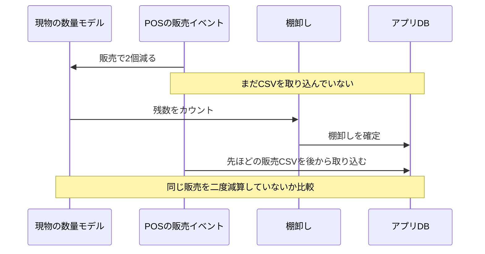
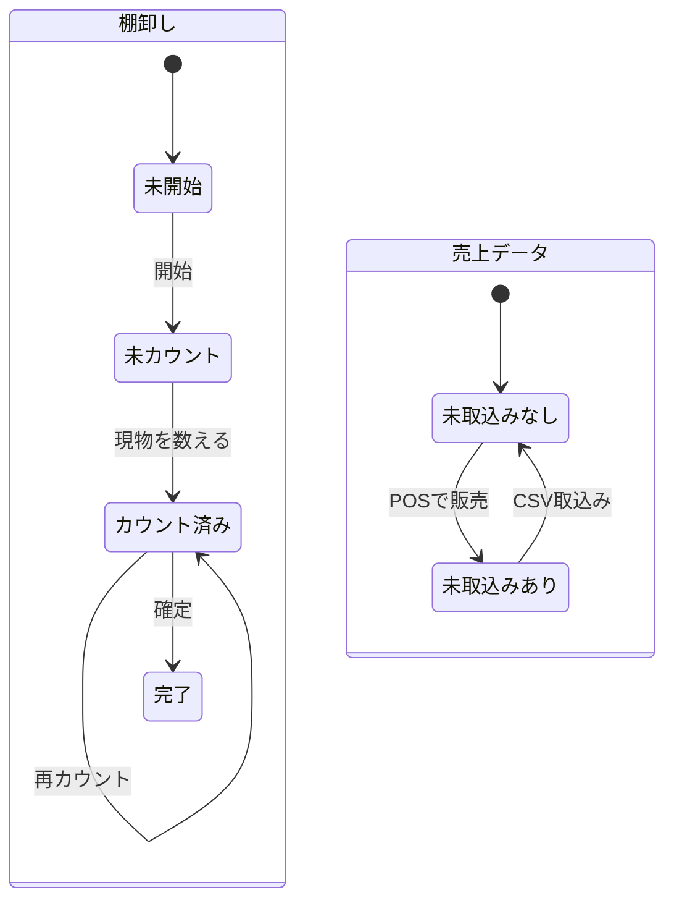
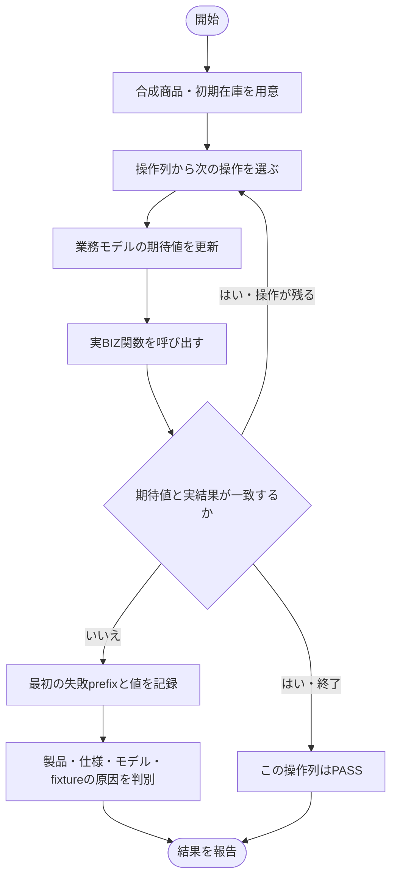

# モデルベースの横断業務検証

> **親文書**: [現行構造の図面](current-system.md)
> **検証対象**: 入庫・手動販売・返品・廃棄・商品別CSVの取込み/取消・棚卸し。実店舗データを使わず、実BIZ関数と一時SQLiteを使用する。

## 図の使い分け

| 名称 | 整理すること | 今回の用途 |
|---|---|---|
| ER図（Entity Relationship Diagram） | データの構造・キー・関係 | [現行DB](../inventory_system_erd.html) |
| シーケンス図（Sequence Diagram） | 誰がいつ何を呼ぶか | 下記のカウント・販売・取込み・確定の前後関係 |
| ステートマシン図（State Machine Diagram） | 状態と許可する遷移 | 下記の棚卸し・未取込み売上の状態 |
| アクティビティ図（Activity Diagram） | 作業の分岐・合流・担当 | 下記の検証手順。Mermaid flowchartによる簡略表現 |
| データフロー図（Data Flow Diagram / DFD） | 入力・処理・保存先・出力 | [在庫と日報の流れ](current-system.md#業務データの流れ)。現行図は厳密なDFD記法ではなく業務フローの簡略表現 |
| C4コンテキスト図 / コンテナ図 | 利用者・外部システム・アプリ・保存先の境界 | POS/PCツール/アプリの責務を見直すときの候補。今回新しい図は増やさない |

一般的な名称を使って目的を明確にし、同じ情報の重複図は増やさない。[C4公式](https://c4model.com/diagrams) も必要な粒度だけを選ぶ方針を示している。

## 検証モデルの契約

これは製品の新しい動作仕様ではなく、既存契約と業務上の期待を検査するためのモデルである。矛盾を見つけても製品コードや採用済み仕様を自動的に変更しない。

### XFA-D1: 記録上の在庫・売上モデル

- 合成商品の初期在庫から開始し、操作の意味だけで期待在庫・売上数量・売上金額を更新する。DBの現在値・movement合計・BIZの計算関数から期待値を作らない。
- 入庫は加算、手動販売と廃棄は減算。レジ未処理返品は加算、レジ処理済みの帳面記録は在庫不変。商品別CSVは売上を作り、`pos_stock_sync=true` の商品だけ在庫へ反映する。
- CSV取消は対象importの寄与だけを取り除く。再取消と同じ冪等キーの再送は業務状態不変。同一キーの別内容や同一hashのactiveファイルは拒否され、業務状態は変わらない。
- 操作後に、商品ごとの在庫、非voidのmovement合計、日次売上の数量・金額を独立モデルと比較する。業務上の拒否では、ヘッダ/明細/売上/movementも増えないことを比較する。失敗を説明する操作ログの追加は許容する。
- 合成商品はJANを共有せず、同じ在庫単位にする。共有JAN、単位変換、価格/原価履歴の意味はこのモデルでは判定しない。

根拠: [在庫処理 §12](../function-design/31-biz-inventory-service.md)、[商品別CSV §15](../function-design/32-biz-csv-import-service.md)、[売上集計](../function-design/34-biz-sales-service.md)。

### XFA-D2: 棚卸しの物理的な数量モデル

- 外部の観測値として「合成シナリオ上、棚に何個あるか」を持つ。手動販売・入庫等の現物移動で変化し、CSVファイルの取込み自体では現物は変化しない。
- POS販売の発生とCSVの取込みを別の操作にする。未取込みの間にDB在庫と現物数が違うことは、それだけで不具合とはしない。
- カウントはその時点の現物数を観測する。カウント後の現物移動を消さず、取込みを完了した時点の在庫が現物と一致することを業務oracleとする。
- 棚卸し確定後にカウントより前の販売データを取り込む場合も、同じ現物減少を二重に計上しないことを検査する。取込み日と発生日の一般的な解決方法は未採用であり、このモデルは具体的な順序の反例を提示するだけとする。
- 再カウント、カウント後に変動がない場合、遅れたCSVを確定前に取り込んだ場合も対照として検証する。

既存の [棚卸し設計](../function-design/35-biz-stocktake-service.md) と [STK-1](../research/2026-09-16-diagram-audit.md#stk-1-カウント後の入出庫を棚卸し確定が打ち消す) は、保存済みactual_countへ在庫を合わせる実装と業務期待の食い違いを示す。本書は特定の修正方式の採用を意味しない。

### XFA-D3: 生成・実行・再現

- 既存のRust test・一時DB・CSV fixture builderを再利用する。業務処理をmockせず、BIZ→DBまで実行する。
- 通常の業務操作について、有限の操作集合から順序付きの組合せを作り、その前後に同日追加取込み・取消・再送・拒否・再接続を組み合わせる。無限の状態空間を網羅したとは主張しない。
- 最初に期待と異なった操作までのprefix、期待値、実値を失敗出力へ残す。これは最初の失敗prefixであり、全ての操作削除候補から求めた最小反例とは呼ばない。
- 接続を閉じて同じ合成DBへ再接続する検証はDB永続化の確認であり、Tauriの再起動やCMDのpreview cache失効の検証とは区別する。

### XFA-D4: 通常テストと診断の判定

- 採用済み契約を守る通常ケースと、モデルが整合した誤値も検出する対照は通常の `cargo test` に含める。
- 棚卸しの既知問題とその近傍を探索する新規診断テストは、`#[ignore = "XFA: explicit diagnostic; known stocktake temporal contract conflict"]` を付けた専用テストとし、診断コマンドで必ず明示実行する。既存テストをignoreに変更しない。
- 診断の期待値を現在の誤動作へ合わせない。違反があれば実際に非0で終了し、実装の不合格として記録する。`should_panic` で正常化したり、panicを握りつぶしてpassにしない。
- 通常suiteのPASSと診断suiteのFAILを別々に報告する。既知問題の修正が採用された際は、該当反例を通常の回帰テストへ移す。

明示実行はRust標準の [ignored test実行](https://doc.rust-lang.org/book/ch11-02-running-tests.html#ignoring-tests-unless-specifically-requested) を使う。新しいテストframeworkや合格判定を緩めるgateは追加しない。

### XFA-D5: 証拠と限界

- 結果を図の矢印とモデルの契約へ対応付ける。新しい不具合、既存STK-1の別経路、仕様上の限界、fixture/モデル側の誤りを分ける。
- 一般的な店舗運用を全て再現したとは主張しない。対象は単一プロセスのBIZ/SQLite、合成商品、整数数量、明示した操作順序である。
- GUI・native dialog・実POS・バックアップ復元・PLU状態・共有JAN・日報bundle・長期運用の全組合せは今回の実行対象外。必要な後続を結果に残す。

## シーケンス図: 発生時点と反映時点

## ステートマシン図: 棚卸しと未取込み売上

両者は独立に状態を持つ。棚卸しが「完了」でも、過去の売上が「未取込みあり」の場合を検証から落とさない。

## アクティビティ図: 操作から検証へ

## 実行結果

追加検証は設計中。実行後に、通常suite、明示診断、対照・mutation検証、未検証範囲を分けて記録する。件数や所要時間は未実測。
