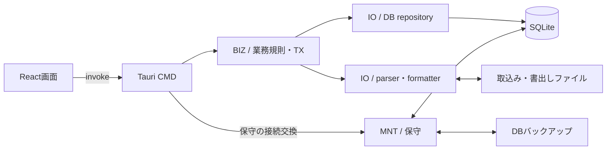
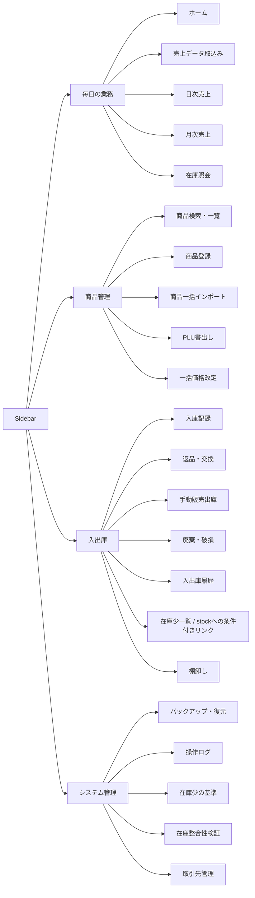
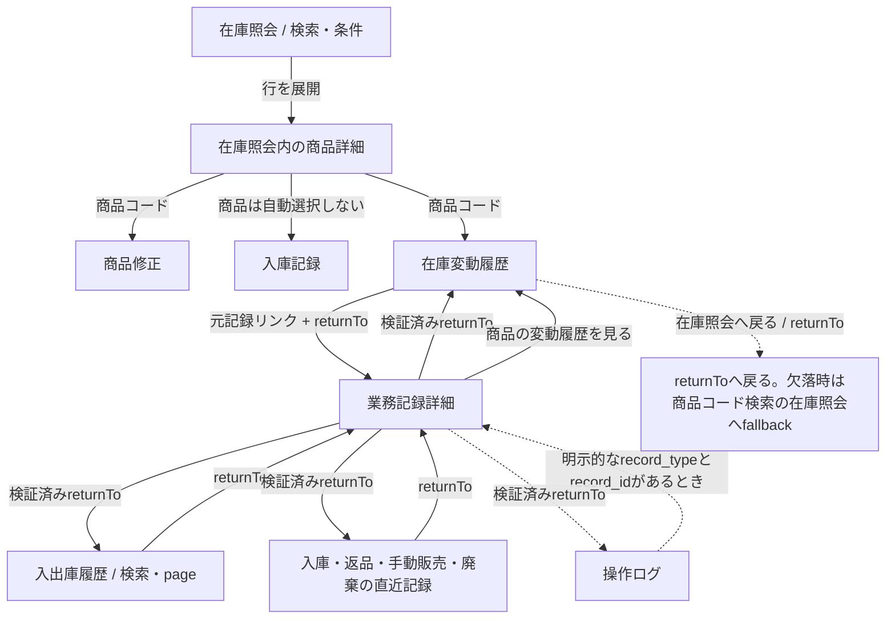
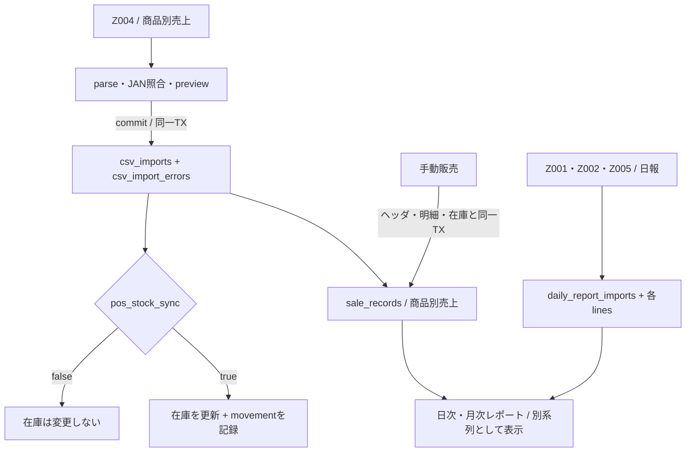
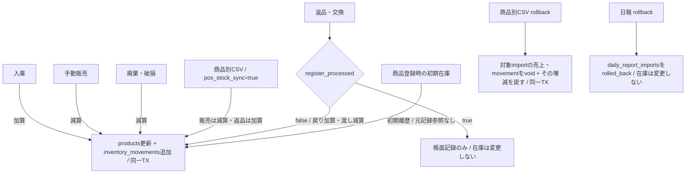
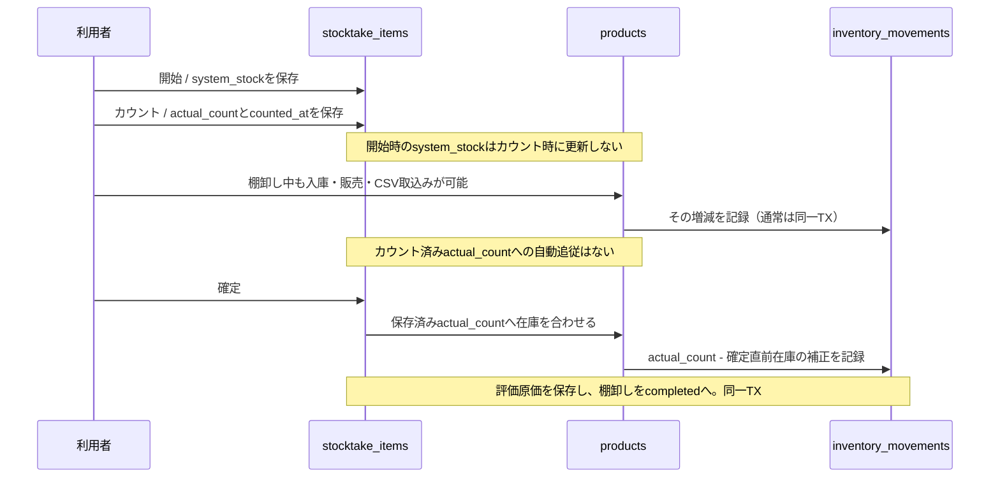
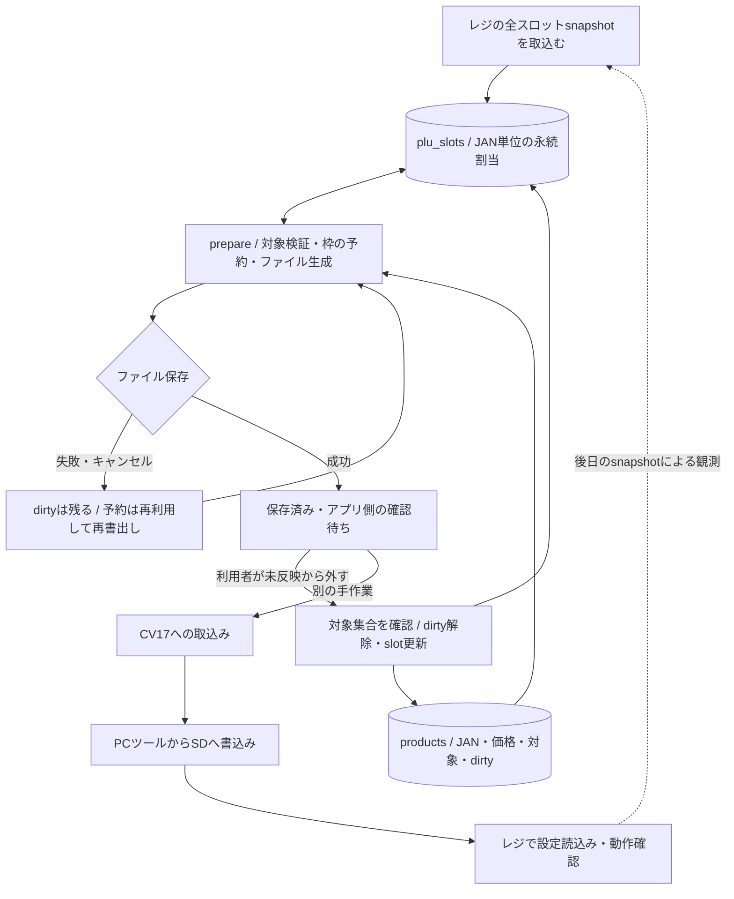

# 現行システムの構造・画面遷移・業務フロー

> **親文書**: [ARCHITECTURE](../ARCHITECTURE.md)、[SCREEN_DESIGN](../SCREEN_DESIGN.md)、[DB_DESIGN](../DB_DESIGN.md)
> **照合基準**: 2026-09-16 の実装。具体的な基準commit・検証結果・残る問題は [図面監査](../research/2026-09-16-diagram-audit.md) を参照。

この資料は現在動く仕組みを説明する。採用済みの将来設計や未実装の機能は、現行の矢印に混ぜない。実装を図に写したことだけでは、その設計が業務上正しいとは判断しない。確認できた不一致と設計上の懸念は監査へ分離する。

| 確認したいこと | 図・正本 |
|---|---|
| 表・カラム・PK/FK・NULL許容 | [現行ER図（HTML）](../inventory_system_erd.html)。関連のみと全カラムを切替えず別々に確認できる |
| どこに責務があるか | 本書「層と外部連携」 |
| どの画面に到達できるか、どう戻るか | 本書「画面の構成」「調査・記録の往復」「route対応表」 |
| 何が売上・在庫を変えるか | 本書「業務データの流れ」「棚卸し」「PLU」 |
| 問題と未確認事項 | [図面監査](../research/2026-09-16-diagram-audit.md) |
| 図から操作列を作って実行する検証 | [シーケンス図・ステートマシン図・モデルベーステスト](cross-feature-verification.md) |

Mermaid対応のMarkdown viewerで図を表示できる。非対応viewerでは図のソースを読む。初期提案の [screen_mockups.html](../screen_mockups.html) と `design-system/reference/` の比較案は現在のrouteやDBの証拠にしない。

## 層と外部連携

実線は主な呼出し・入出力。IOのDB repositoryは物理directory名が `src-tauri/src/db/`、parser/formatterは `src-tauri/src/io/` にある。CMD→MNTは接続交換を含む保守orchestrationの正規経路で、業務規則をCMDへ移す例外ではない。

根拠: [層の契約](../ARCHITECTURE.md)、[起動とcommand登録](../../src-tauri/src/lib.rs)、[CMD](../../src-tauri/src/cmd/mod.rs)、[BIZ](../../src-tauri/src/biz/mod.rs)、[DB](../../src-tauri/src/db/mod.rs)、[IO](../../src-tauri/src/io/mod.rs)。UIのファイル選択・保存はnative pluginを使う入出力であり、業務DBへの直接アクセスではない。`operation_logs` はSQLiteの監査記録、tracingは各層にまたがるDB外の障害追跡ログである。起動時のsetupは復元中断の回復・旧DB移行をDB初期化より先に実行し、初期化後にcleanup・自動backupを呼ぶ。

## 画面の構成

以下の矢印は **Sidebarからの到達・所属**。上下に並ぶ機能を順に実行するという意味ではない。実際のnavigationは [navigation.ts](../../src/config/navigation.ts)、独立画面の有無は [routes](../../src/routes/__root.tsx) が根拠。

- 在庫少一覧は `/stock?status=low_stock`。独立したpageではない。
- 売上データ取込みは `/csv-import` 内で日報と商品別CSVのタブを切り替える。既定は日報。タブごとに別の処理・保存先を持つ。
- 日次・月次売上は別route。レポートの切替controlが両者をつなぐ。
- 在庫照会の商品詳細は一覧内の展開。商品修正は `/products/$code/edit` の別route。
- 整合性検証は在庫台帳と在庫数の突合。未実装の「POS部門別売上との照合」を意味しない。

## 調査・記録の往復

実線は実装された遷移、点線は条件付き遷移または問題のある復帰。矢印に書いた条件を省くと別の挙動になる。特に `returnTo` はURLであり、表示対象の商品IDではない。

### 戻り先・文脈の保持

| 経路 | 現行の状態 |
|---|---|
| 入出庫履歴→記録詳細→戻る | `returnTo` にsearch/pageを保存。検証に失敗した場合は `/inventory/records` |
| 在庫変動履歴→元記録詳細→戻る | `returnTo` に商品・日付・種別・pageを保存 |
| 作業画面の直近記録→詳細→戻る | 元の作業URLへ戻る。URLにない未保存フォームの復元までは保証しない |
| 保存結果→詳細 | 入庫・返品交換・手動販売・廃棄のいずれも直接リンクあり（廃棄は PR #71〈2026-09-16〉で追加、UI-05-D17） |
| 記録詳細→商品別在庫変動履歴 | 商品コードを渡す。来た記録の詳細へ戻る専用stackではない |
| 在庫変動履歴→在庫照会 | 在庫照会へ戻る = `returnTo`（在庫照会からの遷移元 URL）へ戻る。欠落時は商品コードで検索した在庫照会へ fallback（PR #75 で NAV-1 解消） |
| 商品一覧→登録/修正→戻る | 商品画面の `returnTo` を使用。業務記録詳細のfallbackとは別契約 |

根拠: [StockDetailContent](../../src/features/stock-inquiry/components/StockDetailContent.tsx)、[StockMovementsPage](../../src/features/stock-movements/StockMovementsPage.tsx)、[InventoryRecordsPage](../../src/features/inventory-records/InventoryRecordsPage.tsx)、[各記録詳細](../../src/features/inventory-records/ReceivingRecordDetailPage.tsx)、[returnTo検証](../../src/lib/return-to.ts)。詳細から別画面に行けることと、元の操作状態まで復元できることは区別する。

### route対応表

routeの末尾 `/` は統一して省略（ルート `/` 自体を除く）。`$code` 等は動的path。`Outlet` のみの親layoutと `__root` は画面数に含めない。

| 画面 | page route | 主な入口・補足 |
|---|---|---|
| ホーム | `/` | Sidebar |
| 売上データ取込み | `/csv-import` | Sidebar。日報/商品別は同一route内 |
| 日次売上 | `/reports/daily` | Sidebar、取込み完了、手動販売結果 |
| 月次売上 | `/reports/monthly` | Sidebar、日次との切替 |
| 在庫照会 | `/stock` | Sidebar。在庫少は `status=low_stock` |
| 商品検索・一覧 | `/products` | Sidebar |
| 商品登録 | `/products/new` | Sidebar、商品一覧、商品未登録時の導線 |
| 商品修正 | `/products/$code/edit` | 商品一覧、在庫照会内の商品詳細 |
| 商品一括インポート | `/products/import` | Sidebar |
| PLU書出し | `/products/plu-export` | Sidebar、ホームの未反映通知 |
| 一括価格改定 | `/products/price-revision` | Sidebar |
| 入庫記録 | `/inventory/receiving` | Sidebar、在庫照会内の商品詳細 |
| 返品・交換 | `/inventory/return` | Sidebar |
| 手動販売出庫 | `/inventory/manual-sale` | Sidebar |
| 廃棄・破損 | `/inventory/disposal` | Sidebar |
| 入出庫履歴 | `/inventory/records` | Sidebar、各作業の「すべての履歴を見る」 |
| 在庫変動履歴 | `/stock/$code/movements` | 商品詳細、各業務記録詳細 |
| 入庫詳細 | `/inventory/receiving/records/$recordId` | 入出庫履歴、直近記録、保存結果、元記録リンク |
| 返品・交換詳細 | `/inventory/return/records/$recordId` | 同上 |
| 手動販売詳細 | `/inventory/manual-sale/records/$recordId` | 同上 |
| 廃棄・破損詳細 | `/inventory/disposal/records/$recordId` | 同上 |
| 商品別CSV詳細 | `/csv-import/records/$importId` | 入出庫履歴、元記録リンク。取込み結果に直接リンクはない |
| 棚卸し詳細 | `/stocktake/records/$stocktakeId` | 入出庫履歴、元記録リンク。棚卸し結果に直接リンクはない |
| 棚卸し | `/stocktake` | Sidebar。開始前/進行中/完了は画面内state |
| バックアップ・復元 | `/settings/backup` | Sidebar |
| 操作ログ | `/settings/logs` | Sidebar |
| 在庫少の基準 | `/settings/thresholds` | Sidebar |
| 在庫整合性検証 | `/settings/integrity` | Sidebar |
| 取引先管理 | `/settings/suppliers` | Sidebar、取引先pickerの管理導線 |

`/inventory/receiving/records` のような種別専用の一覧routeは現行にはない。完成形設計の専用一覧と、現在の横断ハブを混同しない。日報専用の詳細routeもなく、日報の取込み結果/履歴は取込み画面内で扱う。

## 業務データの流れ

以下は業務上の書込み・読込みの関係で、ERのFK線ではない。商品別売上の同日追加は既存importを上書きせず追加する。重複や確認条件は [商品別CSVの関数設計](../function-design/32-biz-csv-import-service.md) を参照。

### 商品別売上と公式日報

### 在庫の増減と取消

- `products.stock_quantity` と `SUM(inventory_movements.quantity WHERE is_voided=0)` の一致を検証する。`stock_after` は各記録時点の値であり、過去importのvoid後に全履歴を再計算する値ではない。
- 日報は商品別売上へ擬似展開しない。商品別売上と公式日報の総額も足し合わせない。
- 共有JANは `product_code ASC` の先頭商品へ売上を割り当て、warningを表示する。JANから色・サイズの個別SKUは復元できない。[DATA-2](../research/2026-09-16-diagram-audit.md#data-2-共有janの売上は個別skuを識別できない)
- `reference_type + reference_id` は業務記録への論理参照。初期在庫のような元記録を持たないmovementもある。
- 通常業務記録の取消・訂正は将来設計。CSV rollbackの仕組みを入庫・廃棄等に実装済みとして流用描写しない。
- 現行 build では、商品別CSV（Z004）の取込みの確定（図の `Z4`）と取消（図の `ROLLBACK`）は一時停止中で、BIZ の入口が最初の文で停止 error を返し DB を変えない。図は停止前の旧本体の動作である（[停止 ADR](../adr/2026-09-23-legacy-stocktake-z004-write-stop.md)）。

根拠: [入出庫BIZ](../../src-tauri/src/biz/inventory_service/mod.rs)、[商品別CSV BIZ](../../src-tauri/src/biz/csv_import_service/mod.rs)、[日報BIZ](../../src-tauri/src/biz/daily_report_import_service/mod.rs)、[記録追跡設計](../function-design/65-inventory-record-traceability.md)。整合性補正は例外として在庫数をmovement合計へ直接合わせ、movementを増やさず、old/newの操作ログを同一TXで必須保存する（[integrity_service](../../src-tauri/src/biz/integrity_service.rs)）。この一致は実在庫の正しさまで保証しない。

## 棚卸しの時間と在庫

現行 build では、棚卸しの開始・カウント・確定は一時停止中で、BIZ の入口が最初の文で停止 error を返し DB を変えない（[停止 ADR](../adr/2026-09-23-legacy-stocktake-z004-write-stop.md)）。図は停止前の旧本体の動作である。

これは現行動作の図示である。カウント後の入出庫がある場合の時点整合に懸念があり、[STK-1](../research/2026-09-16-diagram-audit.md#stk-1-カウント後の入出庫を棚卸し確定が打ち消す) に例と根拠を記録した。`counted_at` を保存することと、確定時にその後の増減を反映することは別である。

根拠: [stocktake_service](../../src-tauri/src/biz/stocktake_service.rs)、[stocktake_repo](../../src-tauri/src/db/stocktake_repo.rs)、[棚卸し関数設計](../function-design/35-biz-stocktake-service.md)。未入力補完は明示確認後の `force_fill` で確定時点の在庫（負値は0）を採用し、既存カウントの時点問題とは別経路になる。

## PLUのアプリ内状態と外部反映

- 保存・アプリ側確認・レジ反映は別の出来事。`plu_exported_at`、slotの `active` / `activated_at` だけで実レジへの反映完了を証明しない。
- `products.jan_code` と `plu_slots.scanning_code` の結合はFKではない。共有JANの商品は同じslotを使う。外部登録や解放待ちのslotは対応する商品を持たない場合もある。
- 基本経路は `free → reserved → active → release_pending → free`。snapshotによるexternal採用・衝突・missing、再対象化、clear無効時の例外は [slot状態遷移表](../db-design/plu-tables.md) を正本とする。
- slotとsnapshot設定は売上・在庫の集計対象ではない。

根拠: [plu_export_service](../../src-tauri/src/biz/plu_export_service.rs)、[PLU画面設計](../function-design/67-ui-plu-export.md)、[slot定義](../db-design/plu-tables.md)。

## 更新するとき

- schema/migration変更時: テーブル定義とERのカラム・FK・NULL許容・状態を同期する。実装にない将来列を加えない。
- navigation/route変更時: route対応表と到達図を更新し、具体的なLink/search/returnToまで確認する。
- 在庫・売上・日報・PLU・棚卸しの変更時: 何をどのTXで保存するか、在庫を動かさない分岐、失敗・再試行・取消の経路を見直す。
- 文書チェックの成功だけを図の正確性の証拠にしない。schema/routeの照合とMermaidのrenderを行う。図の更新で発見した業務判断は、関数設計・DB設計・decision-logの適切な正本へ昇格させる。
